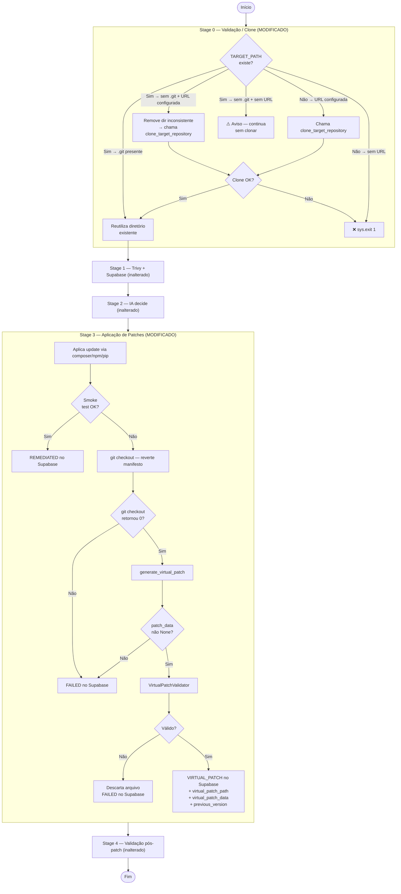

# Design Document — remote-repo-scan-and-virtual-patch

## Overview

Este documento descreve o design técnico para duas novas funcionalidades incorporadas ao **Framework Autônomo de Remediação SCA** (`framework.py`):

**Feature 1 — Clonagem remota automática no Stage0**: O `stage0_validate_target()` passa a ser capaz de clonar o repositório alvo quando o diretório `TARGET_PATH` ainda não existe, delegando a operação para `clone_target_repository()` já disponível em `context_collector.py`. Quando o diretório já existe (cenário GitHub Actions), o comportamento atual é preservado.

**Feature 2 — Virtual patching aprimorado com validação pós-geração**: O fluxo de fallback para virtual patch (ativado quando o smoke test detecta que um update quebra a aplicação) é estendido com: (a) verificação explícita do sucesso do `git checkout` de reversão, (b) um `VirtualPatchValidator` que verifica existência, tamanho mínimo e sintaxe do arquivo gerado antes de persistir, e (c) registro estruturado no Supabase com `virtual_patch_path`, `virtual_patch_data` e `previous_version`.

Nenhuma funcionalidade existente (scan Trivy, agente Gemini, estratégia same-major, banco curado, OSV API, smoke test, auditoria Supabase, pipeline dupla, suporte PHP/Node.js/Python) é removida ou alterada em seu comportamento observável.

---

## Architecture

O framework mantém sua arquitetura de pipeline linear em quatro estágios. As duas features intervêm em pontos cirúrgicos sem criar novos módulos externos.



---

## Components and Interfaces

### 1. `stage0_validate_target()` — `framework.py` (modificado)

Atualmente, a função lê `TARGET_PATH` e encerra com `sys.exit(1)` caso o diretório não exista. A nova lógica adiciona três ramificações:

| Condição | Comportamento novo |
|---|---|
| `TARGET_PATH` existe **e** contém `.git/` | Reutiliza — comportamento idêntico ao atual |
| `TARGET_PATH` existe **mas sem** `.git/` **e** `TARGET_REPO_URL` configurada | Remove diretório inconsistente → delega para `clone_target_repository()` |
| `TARGET_PATH` existe **mas sem** `.git/` **e sem** `TARGET_REPO_URL` | Registra aviso, continua sem clonar (compatibilidade) |
| `TARGET_PATH` **não existe** **e** `TARGET_REPO_URL` configurada | Delega para `clone_target_repository()` |
| `TARGET_PATH` **não existe** **e sem** `TARGET_REPO_URL` | `log(..., "ERROR")` + `sys.exit(1)` |

**Assinatura pública** — inalterada: retorna `(target_path: str, repo_name: str)`.

**Import adicionado** em `framework.py`:
```python
from context_collector import (
    detect_ecosystem,
    detect_ecosystems,
    clone_target_repository,   # novo import
)
```

### 2. `clone_target_repository()` — `context_collector.py` (reutilizado sem modificações)

A função já existe e implementa exatamente o comportamento necessário:
- Aceita `repo_url`, `branch` (padrão `"main"`) e `target_path` opcional
- Autentica via `GH_TOKEN` / `GITHUB_TOKEN` / `PAT`
- Executa `git clone --depth 1 --branch <branch> <url> <target_path>`
- Reutiliza o diretório se já for um repositório Git
- Retorna o caminho absoluto em caso de sucesso ou `None` em caso de falha

Nenhuma alteração é necessária neste módulo.

### 3. `VirtualPatchValidator` — `framework.py` (novo)

Função interna `validate_virtual_patch(patch_data, ecosystem)` adicionada a `framework.py`:

```
validate_virtual_patch(patch_data: dict | None, ecosystem: str) -> bool
```

Executa em sequência:

1. **Existência**: `os.path.isfile(patch_data["file_path"])` → falha → log + return False
2. **Tamanho**: `os.path.getsize(file_path) > 50` → falha → log + return False
3. **Sintaxe** (depende do ecossistema):
   - Python → `subprocess.run([sys.executable, "-m", "py_compile", file_path])`
   - PHP → `subprocess.run(["php", "-l", file_path])`
   - Node.js → `subprocess.run(["node", "--check", file_path])`
   - Outros → sem verificação de sintaxe, retorna True
4. Em caso de falha de sintaxe → log + tenta `os.remove(file_path)` + return False
5. Se tudo passa → return True

### 4. `generate_virtual_patch()` — `framework.py` (modificado)

A função existente é estendida para:
- Verificar o código de retorno do `git checkout` **antes** de chamar `gerar_virtual_patch()`
- Chamar `validate_virtual_patch()` no resultado retornado por `gerar_virtual_patch()`
- Persistir no Supabase somente se a validação passar
- Marcar `remediation_status = 'FAILED'` se o `git checkout` falhar ou a validação falhar

### 5. `gerar_virtual_patch()` — `scripts/ai_agent.py` (sem modificações)

A função já implementa:
- Geração de código via Gemini com extensão `.php` / `.js` / `.py` por ecossistema
- Cabeçalho de identificação com package, CVEs e timestamp ISO 8601
- Salvamento em `{target_path}/virtual_patches/{nome_seguro}_virtual_patch.{ext}`
- Criação do diretório `virtual_patches/` se ausente
- Encoding UTF-8
- Retorno de `{"patch_code": str, "file_path": str, "justification": str}` ou `None`

Nenhuma alteração é necessária neste módulo.

### 6. `vulnerability_records` — `database/schema.sql` (migração necessária)

As colunas `virtual_patch_path` e `virtual_patch_data` ainda **não existem** no schema atual. É necessária uma migration:

```sql
ALTER TABLE vulnerability_records
    ADD COLUMN IF NOT EXISTS virtual_patch_path TEXT,
    ADD COLUMN IF NOT EXISTS virtual_patch_data  TEXT;
```

O `remediation_status` já aceita os valores necessários (`OPEN`, `REMEDIATED`, `FAILED`). O valor `VIRTUAL_PATCH` precisa ser documentado como valor válido (a coluna é TEXT sem constraint CHECK, portanto já aceita o valor sem alteração de schema).

---

## Data Models

### Variáveis de Ambiente (lidas por `framework.py`)

| Variável | Padrão | Descrição |
|---|---|---|
| `TARGET_PATH` | `/tmp/target-repo` | Caminho local do repositório alvo |
| `TARGET_REPO_URL` | `""` | URL HTTPS do repositório remoto |
| `TARGET_REPO_BRANCH` | `"main"` | Branch a ser clonada |
| `TARGET_BRANCH_FIX` | `"fix-remediation"` | Branch de push de patches |
| `GH_TOKEN` / `GITHUB_TOKEN` / `PAT` | — | Token de autenticação GitHub |

Todas as variáveis já existem ou são lidas atualmente; nenhuma nova variável é adicionada.

### Schema — `vulnerability_records` (após migration)

```sql
-- Colunas existentes relevantes
remediation_status  TEXT DEFAULT 'OPEN',
    -- Valores: OPEN | REMEDIATED | FAILED | ROLLED_BACK | VIRTUAL_PATCH (novo valor documentado)
previous_version    TEXT,                 -- versão antes do revert (já existe)

-- Colunas novas (migration)
virtual_patch_path  TEXT,                 -- caminho absoluto do arquivo gerado
virtual_patch_data  TEXT,                 -- código completo do patch
```

### Estrutura de Diretório do Repositório Alvo

```
{TARGET_PATH}/
├── .git/
├── composer.json          (PHP)
├── composer.lock          (PHP)
├── package.json           (Node.js)
├── package-lock.json      (Node.js)
├── requirements.txt       (Python)
└── virtual_patches/       ← criado pelo ai_agent.py
    ├── vendor_package_virtual_patch.php
    ├── some_lib_virtual_patch.js
    └── some_lib_virtual_patch.py
```

**Regra de nomeação**: `nome_do_pacote` com `/` e `-` substituídos por `_`, sufixo `_virtual_patch`, extensão por ecossistema.

Exemplos:
- `guzzlehttp/guzzle` (PHP) → `guzzlehttp_guzzle_virtual_patch.php`
- `lodash` (Node.js) → `lodash_virtual_patch.js`
- `requests` (Python) → `requests_virtual_patch.py`

### Fluxo de dados do Virtual Patch

```
gerar_virtual_patch()
    └─ retorna: {
           "patch_code":    "<conteúdo UTF-8 do arquivo>",
           "file_path":     "<TARGET_PATH>/virtual_patches/<nome>_virtual_patch.<ext>",
           "justification": "<texto explicativo>"
       }
       ou None (falha)

validate_virtual_patch(patch_data, ecosystem)
    └─ retorna: bool

UPDATE vulnerability_records SET
    remediation_status  = 'VIRTUAL_PATCH',
    virtual_patch_path  = patch_data["file_path"],
    virtual_patch_data  = patch_data["patch_code"],
    previous_version    = <installed_version antes do update>,
    updated_at          = NOW()
WHERE package_name = <pkg> AND ecosystem = <eco>
  AND decision_status = 'APPROVED'
  AND remediation_status = 'OPEN'
```

---

## Correctness Properties

*A property is a characteristic or behavior that should hold true across all valid executions of a system — essentially, a formal statement about what the system should do. Properties serve as the bridge between human-readable specifications and machine-verifiable correctness guarantees.*

---

### Property 1: Reversão usa os arquivos de manifesto corretos para cada ecossistema

*Para qualquer* ecossistema em `{PHP, Node.js, Python}`, quando o smoke test retorna `False` após um update de dependência e o `git checkout` de reversão é executado, o conjunto de arquivos passados ao comando deve corresponder exatamente aos manifestos daquele ecossistema (PHP → `composer.json`, `composer.lock`; Node.js → `package.json`, `package-lock.json`; Python → `requirements.txt`).

**Validates: Requirements 4.1**

---

### Property 2: previous_version preserva a versão instalada antes do revert

*Para qualquer* registro de vulnerabilidade com `installed_version = V`, quando o `remediation_status` é atualizado para `VIRTUAL_PATCH`, o campo `previous_version` no Supabase deve conter exatamente o valor `V`.

**Validates: Requirements 4.4, 8.3**

---

### Property 3: Extensão do arquivo de virtual patch corresponde ao ecossistema

*Para qualquer* ecossistema em `{PHP, Node.js, Python}`, o `file_path` retornado por `gerar_virtual_patch()` deve terminar com a extensão correspondente: `.php` para PHP, `.js` para Node.js, `.py` para Python.

**Validates: Requirements 5.2**

---

### Property 4: Cabeçalho do virtual patch contém todos os campos obrigatórios

*Para qualquer* combinação de `package_name` e lista de `cves` fornecida a `gerar_virtual_patch()`, o conteúdo do arquivo gerado deve conter: uma identificação como virtual patch gerado automaticamente, o nome do pacote, cada CVE da lista e um timestamp no formato ISO 8601.

**Validates: Requirements 5.3**

---

### Property 5: Naming convention do arquivo de virtual patch

*Para qualquer* `package_name`, o campo `file_path` retornado por `gerar_virtual_patch()` deve obedecer à convenção: o nome do pacote com todos os `/` e `-` substituídos por `_`, seguido de `_virtual_patch`, seguido da extensão correta para o ecossistema, dentro do subdiretório `virtual_patches/` do `target_path`.

**Validates: Requirements 6.1**

---

### Property 6: Retorno de gerar_virtual_patch contém as três chaves obrigatórias

*Para qualquer* geração bem-sucedida de virtual patch, o dicionário retornado por `gerar_virtual_patch()` deve conter exatamente as chaves `patch_code`, `file_path` e `justification`, todas com valores não-nulos e não-vazios.

**Validates: Requirements 6.4**

---

### Property 7: Validação rejeita arquivos com 50 bytes ou menos

*Para qualquer* arquivo de virtual patch cujo tamanho em bytes seja `<= 50`, o `VirtualPatchValidator` deve retornar `False` e nenhuma atualização de status `VIRTUAL_PATCH` deve ser persistida no Supabase.

**Validates: Requirements 7.2**

---

### Property 8: virtual_patch_path e virtual_patch_data são ambos persistidos ou nenhum

*Para qualquer* virtual patch válido que resulta em atualização do `remediation_status` para `VIRTUAL_PATCH`, ambos os campos `virtual_patch_path` e `virtual_patch_data` devem ser preenchidos com valores não-nulos no mesmo UPDATE. Nunca um sem o outro.

**Validates: Requirements 8.2**

---

## Error Handling

### Stage 0 — Clonagem Remota

| Situação | Resposta |
|---|---|
| `TARGET_PATH` inexistente e `TARGET_REPO_URL` vazia | `log(..., "ERROR")` + `sys.exit(1)` |
| `clone_target_repository()` retorna `None` | `log(..., "ERROR")` + `sys.exit(1)` |
| `TARGET_PATH` existe sem `.git/` e sem `TARGET_REPO_URL` | `log(..., "WARN")` + continua pipeline |
| `TARGET_PATH` existe sem `.git/` com `TARGET_REPO_URL` | Remove diretório + re-clona; falha → `sys.exit(1)` |
| Timeout de 180 s no `git clone` | Já tratado por `clone_target_repository()` (retorna `None`) |

### Stage 3 — Reversão e Virtual Patch

| Situação | Resposta |
|---|---|
| `git checkout` retorna código ≠ 0 | Log de erro + marca `remediation_status = FAILED`; não tenta gerar virtual patch |
| `git` não encontrado no PATH | `subprocess.CalledProcessError` capturado → mesmo comportamento acima |
| `gerar_virtual_patch()` retorna `None` | Log de aviso + marca `remediation_status = FAILED` |
| `gerar_virtual_patch()` lança exceção | Capturada no `try/except` de `generate_virtual_patch()` → retorna `None` → mesmo fluxo |
| Arquivo não existe no `file_path` informado | `VirtualPatchValidator` retorna `False` → sem persistência no Supabase |
| Arquivo ≤ 50 bytes | Mesmo fluxo acima |
| Sintaxe inválida (`py_compile` / `php -l` / `node --check` falha) | Log de aviso + tenta `os.remove(file_path)` + `remediation_status = FAILED` |
| Falha parcial no `os.remove` do arquivo inválido | Ignorada — não impede a atualização de status no Supabase |
| Falha no UPDATE do Supabase para `VIRTUAL_PATCH` | Já existe `conn.rollback()` em `db_safe`; o registro permanece `OPEN` para reprocessamento |

### Preservação de Transações

Todos os `cur.execute(UPDATE ...)` dentro de `stage3_apply_patches()` são seguidos por `conn.commit()` ao final do loop de ecossistema — comportamento existente preservado. A nova lógica de virtual patch segue o mesmo padrão, garantindo que falhas isoladas não deixem a conexão em estado de erro.

---

## Testing Strategy

### Abordagem dual: testes de exemplo + testes de propriedade

Os testes de exemplo cobrem caminhos concretos, condições de erro e integrações com processos externos (git, subprocess). Os testes de propriedade cobrem invariantes universais usando geração aleatória de entradas.

A biblioteca de property-based testing escolhida é **Hypothesis** (Python), compatível com o ecossistema do projeto e com suporte nativo ao `pytest`.

```
pip install hypothesis pytest
```

---

### Testes de Exemplo (pytest)

#### Feature 1 — Stage 0

| Cenário | Assertiva |
|---|---|
| `TARGET_PATH` com `.git/` existente | `stage0` retorna o path sem chamar `clone_target_repository` |
| `TARGET_PATH` sem `.git/`, sem URL | `stage0` loga aviso e retorna o path |
| `TARGET_PATH` sem `.git/`, com URL | Dir removido + `clone_target_repository` chamado |
| `TARGET_PATH` inexistente, com URL, clone OK | `stage0` retorna path clonado |
| `TARGET_PATH` inexistente, com URL, clone falha | `SystemExit(1)` levantado |
| `TARGET_PATH` inexistente, sem URL | `SystemExit(1)` levantado |

Todos os cenários usam `monkeypatch` do pytest para isolar `clone_target_repository` e variáveis de ambiente.

#### Feature 2 — Reversão e Virtual Patch

| Cenário | Assertiva |
|---|---|
| `git checkout` retorna código 0 | `gerar_virtual_patch` é invocado |
| `git checkout` retorna código ≠ 0 | `gerar_virtual_patch` não é invocado; status = FAILED |
| `gerar_virtual_patch` retorna `None` | Status = FAILED; sem UPDATE VIRTUAL_PATCH |
| `validate_virtual_patch` recebe arquivo inexistente | Retorna `False`; status = FAILED |
| Arquivo Python com sintaxe inválida | `py_compile` falha; retorna `False` |
| Arquivo PHP com sintaxe inválida (mock `php -l`) | Retorna `False` |
| Arquivo Node.js com sintaxe inválida (mock `node --check`) | Retorna `False` |
| Validação passa → Supabase UPDATE | `virtual_patch_path`, `virtual_patch_data`, `previous_version` presentes no UPDATE |

---

### Testes de Propriedade (Hypothesis)

Cada propriedade abaixo corresponde a uma Correctness Property do documento e deve ser configurada com `@settings(max_examples=100)`.

**Tag format**: `# Feature: remote-repo-scan-and-virtual-patch, Property N: <texto>`

#### Property 1 — Manifesto correto por ecossistema

```python
# Feature: remote-repo-scan-and-virtual-patch, Property 1: revert usa manifestos corretos
@given(ecosystem=st.sampled_from(["PHP", "Node.js", "Python"]))
@settings(max_examples=100)
def test_revert_uses_correct_manifest_files(ecosystem):
    # Para qualquer ecossistema, verifica que git checkout recebe os arquivos certos
    expected = {
        "PHP":     {"composer.json", "composer.lock"},
        "Node.js": {"package.json", "package-lock.json"},
        "Python":  {"requirements.txt"},
    }[ecosystem]
    # mock subprocess.run, chama lógica de revert, assert args contêm expected
```

#### Property 2 — previous_version preservada

```python
# Feature: remote-repo-scan-and-virtual-patch, Property 2: previous_version preservada
@given(version=st.text(min_size=1, max_size=30, alphabet=st.characters(whitelist_categories=("Lu","Ll","Nd"), whitelist_characters=".-")))
@settings(max_examples=100)
def test_previous_version_equals_installed_version(version):
    # Para qualquer versão V, o UPDATE ao Supabase deve ter previous_version = V
```

#### Property 3 — Extensão do arquivo por ecossistema

```python
# Feature: remote-repo-scan-and-virtual-patch, Property 3: extensão correta por ecossistema
@given(ecosystem=st.sampled_from(["PHP", "Node.js", "Python"]),
       package_name=st.text(min_size=1, max_size=50))
@settings(max_examples=100)
def test_virtual_patch_file_extension(ecosystem, package_name):
    expected_ext = {"PHP": ".php", "Node.js": ".js", "Python": ".py"}[ecosystem]
    # mock genai, chama gerar_virtual_patch, assert file_path.endswith(expected_ext)
```

#### Property 4 — Cabeçalho obrigatório no patch

```python
# Feature: remote-repo-scan-and-virtual-patch, Property 4: cabeçalho contém campos obrigatórios
@given(package_name=st.text(min_size=1, max_size=50),
       cves=st.lists(st.text(min_size=5, max_size=20), min_size=1, max_size=5))
@settings(max_examples=100)
def test_virtual_patch_header_contains_required_fields(package_name, cves):
    # mock genai para retornar conteúdo com header template, assert presença dos campos
```

#### Property 5 — Naming convention do arquivo

```python
# Feature: remote-repo-scan-and-virtual-patch, Property 5: naming convention do arquivo
@given(package_name=st.text(min_size=1, max_size=60,
       alphabet=st.characters(whitelist_categories=("Lu","Ll","Nd"), whitelist_characters="/-_")),
       ecosystem=st.sampled_from(["PHP", "Node.js", "Python"]))
@settings(max_examples=100)
def test_virtual_patch_naming_convention(package_name, ecosystem):
    safe_name = package_name.replace("/", "_").replace("-", "_")
    ext = {"PHP": ".php", "Node.js": ".js", "Python": ".py"}[ecosystem]
    expected_suffix = f"{safe_name}_virtual_patch{ext}"
    # assert file_path.endswith(expected_suffix)
```

#### Property 6 — Retorno contém as três chaves obrigatórias

```python
# Feature: remote-repo-scan-and-virtual-patch, Property 6: retorno com três chaves
@given(package_name=st.text(min_size=1, max_size=50),
       cves=st.lists(st.text(min_size=5), min_size=1, max_size=3),
       ecosystem=st.sampled_from(["PHP", "Node.js", "Python"]))
@settings(max_examples=100)
def test_virtual_patch_return_dict_has_required_keys(package_name, cves, ecosystem):
    # mock genai com conteúdo válido, assert "patch_code", "file_path", "justification" in result
```

#### Property 7 — Rejeição de arquivos <= 50 bytes

```python
# Feature: remote-repo-scan-and-virtual-patch, Property 7: rejeição de arquivos pequenos
@given(size=st.integers(min_value=0, max_value=50))
@settings(max_examples=100)
def test_validator_rejects_files_at_or_below_50_bytes(size):
    # cria arquivo com `size` bytes, chama validate_virtual_patch, assert retorna False
```

#### Property 8 — path e data persistidos juntos

```python
# Feature: remote-repo-scan-and-virtual-patch, Property 8: path e data sempre juntos
@given(package_name=st.text(min_size=1, max_size=50),
       ecosystem=st.sampled_from(["PHP", "Node.js", "Python"]))
@settings(max_examples=100)
def test_virtual_patch_path_and_data_persisted_together(package_name, ecosystem):
    # mock válido: assert UPDATE contém virtual_patch_path != None e virtual_patch_data != None
    # mock inválido: assert UPDATE não é chamado com status VIRTUAL_PATCH
```

---

### Notas sobre Isolamento

- Todos os testes que envolvem chamadas ao Gemini devem usar `unittest.mock.patch` em `google.generativeai.GenerativeModel.generate_content` para retornar conteúdo pré-definido, evitando chamadas de rede reais.
- Chamadas ao Supabase nos testes de propriedade usam `psycopg2` com cursor mockado.
- Testes de sintaxe de arquivo (`py_compile`, `php -l`, `node --check`) podem usar arquivos reais em diretórios temporários (`tmp_path` do pytest) para Python, e mocks de `subprocess.run` para PHP e Node.js (evitando dependência de runtime externo no CI).
